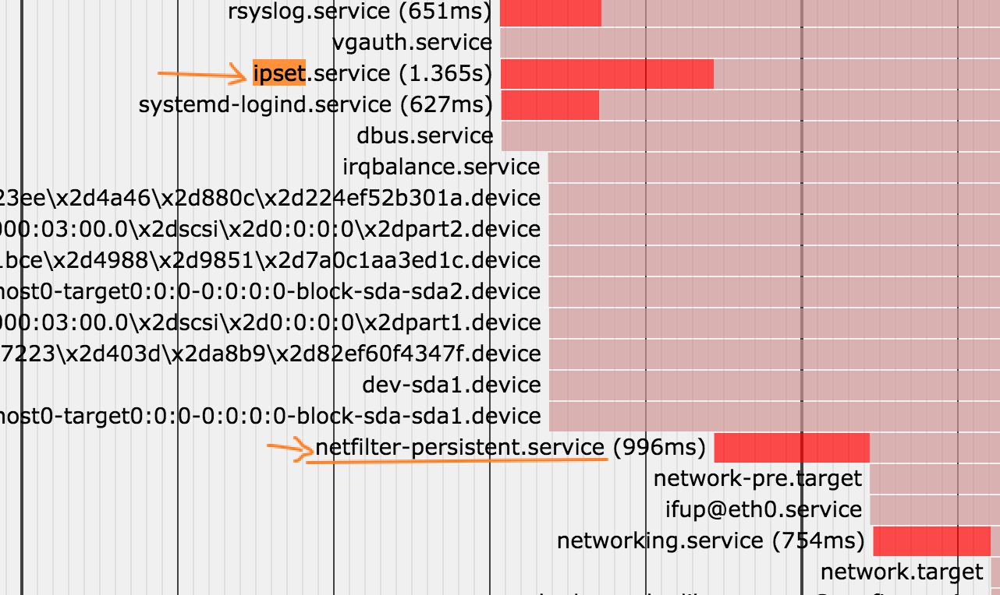

# systemd-ipset-service by Bro Hui
The missing ipset service configure file for CentOS/RHEL 7

### How to use this
```
#cp -p ipset.start-stop /usr/local/bin/ipset.start-stop
#cp -p ipset.service /lib/systemd/system/ipset.service
#chmod 755 /lib/systemd/system/ipset.service /usr/local/bin/ipset.start-stop
```

### Start with system boot
```
#systemctl enable ipset
```



This ipset service will boot before iptables and network service.

### Check it
Save your ipset configution first.

```
#ipset save > /etc/ipset.conf
```


Flush your ipset

```
#ipset flush
```

Restore your ipset

```
#systemctl start ipset
```

```
#ipset list
```
